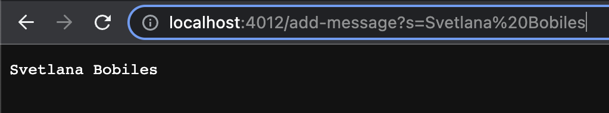
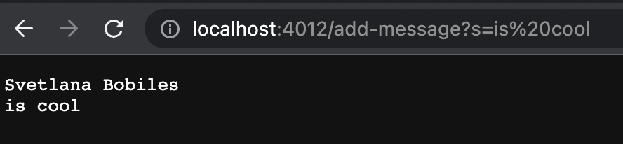
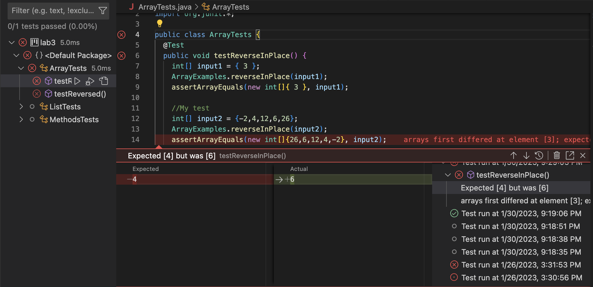
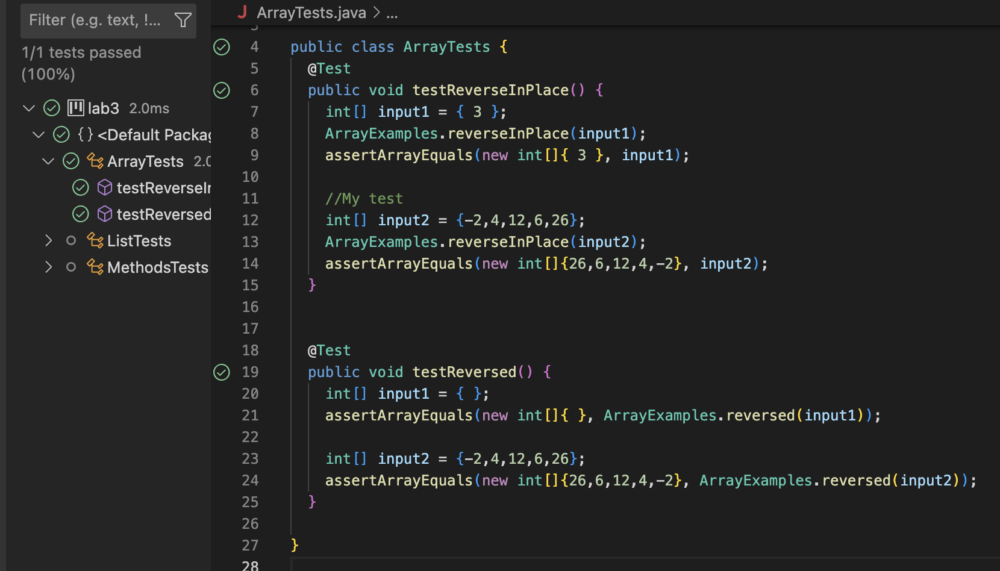

# CSE 15L Lab Report 2

## Part 1:

**Code:**

    import java.io.IOException;
    import java.net.URI;

    class Handler implements URLHandler {
        // The one bit of state on the server: a number that will be manipulated by
        // various requests.
        String message = "";

        public String handleRequest(URI url) 
        {
            if(url.getPath().contains("/add-message"))
            {
                String[] arr = url.getQuery().split("=");
                if(arr[0].equals("s"))
                {
                    message += arr[1] + "\n";
                }
            }

            return message;
        }
    }

    public class StringServer
    {
        public static void main(String[] args) throws IOException 
        {
            if(args.length == 0)
            {
                System.out.println("Missing port number! Try any number between 1024 to 49151");
            return;
            }

            int port = Integer.parseInt(args[0]);

            Server.start(port, new Handler());
        }
    }

* The method in my code that was called was handleRequest.
* The relevant arguments to that method was the url because it checks to see if the path has "/add-message" which will cause the code to add the string afterwards to the server.
* I also made an instance variable to keep track of the strings that were added.
* The values of the class was changed because the instance variable 'message' was empty until the first time the user used that command.

* The method in my code that was called was handleRequest.
* The relevant arguments to that method was the url because it checks to see if the path has "/add-message" which will cause the code to add the string afterwards to the server.
* I also made an instance variable to keep track of the strings that were added.
* The values of the class was changed because the instance variable 'message' contained "Svetlana Bobiles" but after the user wrote "/add-message?s=is%20cool" it added the new string, "is cool" to the variable message and on a new line.

## Part 2:

**Failure Inducing Input:**

    public void testReverseInPlace()
    {
        My test
        int[] input2 = {-2,4,12,6,26};
        ArrayExamples.reverseInPlace(input2);
        assertArrayEquals(new int[]{26,6,12,4,-2}, input2);
    }
    
**Passing Input:**

    public void testReverseInPlace()
    {
        int[] input1 = { 3 };
        ArrayExamples.reverseInPlace(input1);
        assertArrayEquals(new int[]{ 3 }, input1);
    }

**Symptom**

**Original Code**

    for(int i = 0; i < arr.length; i += 1) 
    {
      arr[i] = arr[arr.length - i - 1];
    }

**My Fixed Code**

    for(int i = 0; i < arr.length/2; i += 1) 
    {
      int temp = arr[i];
      arr[i] = arr[arr.length - i - 1];
      arr[arr.length-i-1] = temp;
    }

**Junit fixed code**

    
The original code was a for loop that assigned the value of what the array would be like in reverse. But the issue was that once it reaches halfway it repeats itself because the beginning of the array was already replaced, so the second half doesn't have what the array had in the beginning. So I fixed this by creating a temporary variable to keep what the element was at the i index and replaced 2 indexes at the same time. Since I'm doing 2 at the same time I also split the for loop length in half, so it won't create an out of bounds error.

## Part 3:

Something I learned from the past 2 labs was how github desktop works and how it's useful in committing changes to the server. It was also interesting experimenting with the URLHandler Interface and creating different code, like the "search engine" or trying out the different paths and queries in NumberServer.
