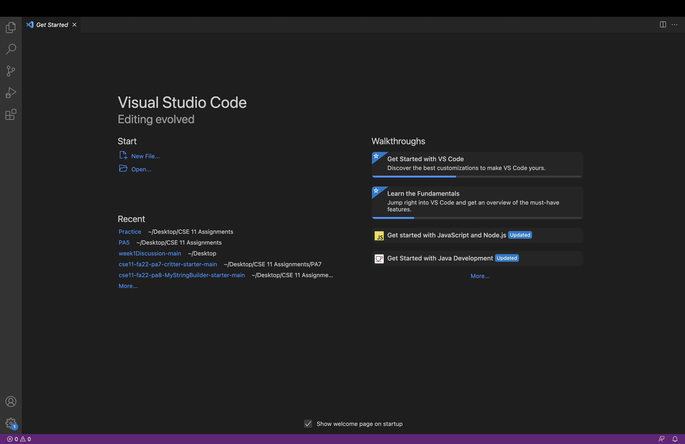
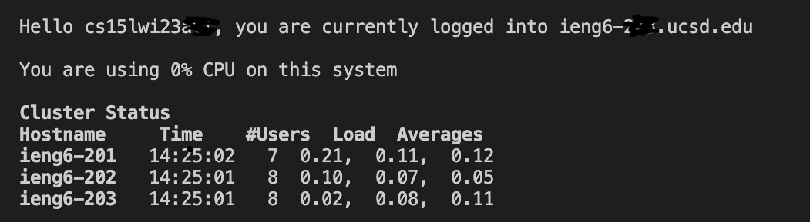
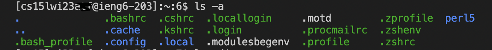

# Remote Access
___

1) Installing VSCode

* I did not install VSCode because I already have it on my computer
* But I went on VSCode and created a file and opened the integrated terminal

2) Remotely Connecting

* Then I typed in the terminal the command "ssh cs15lwi23atf@ieng6.ucsd.edu" to connect to the server
* I was prompted "Are you sure you want to continue connecting(yes/no/[fingerprint])? and said yes and put in my password

3) Commands

* After I connected to the server I tried multiple commands like cd ~, ls lat, cp /home/linux/ieng6/cs15lwi23/public/hello.txt ~/, etc
* It was interesting seeing the information be presented after typing in the command, or changing the directory.

